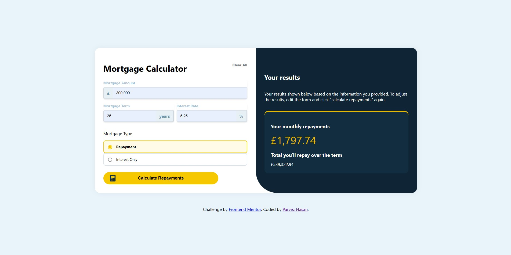

## Table of contents

- [Overview](#overview)
  - [The challenge](#the-challenge)
  - [Screenshot](#screenshot)
  - [Links](#links)
- [My process](#my-process)
  - [Continued development](#continued-development)
  - [Useful resources](#useful-resources)
- [Author](#author)


## Overview

### The challenge

Users should be able to:

- Input mortgage information and see monthly repayment and total repayment amounts after submitting the form
- See form validation messages if any field is incomplete
- Complete the form only using their keyboard
- View the optimal layout for the interface depending on their device's screen size
- See hover and focus states for all interactive elements on the page

### Screenshot



### Links

- Solution URL: [Add solution URL here](https://your-solution-url.com)
- Live Site URL: [Add live site URL here](https://your-live-site-url.com)

## My process

### Built with

- Semantic HTML5 markup
- CSS custom properties
- Flexbox
- JavaScript

### What I learned

Use this section to recap over some of your major learnings while working through this project. Writing these out and providing code samples of areas you want to highlight is a great way to reinforce your own knowledge.

To see how you can add code snippets, see below:

```html
<h1>Some HTML code I'm proud of</h1>
```

```HTML
          <div class="wrapping-span-input">
            <span class="symbol">£</span>
            <input
              type="text"
              id="mortgage-amount"
              placeholder="e.g. 100,000"
              required
            />
          </div>
```

```CSS

.mortgage-option {
  display: flex;
  border: 2px solid #dbe3eb;
  border-radius: 8px;
  padding: 12px 10px;
  font-size: 14px;
  cursor: pointer;
  gap: 12px;
}

.mortgage-option input[type="radio"] {
  appearance: none;
  width: 16px;
  height: 16px;
  border: 2px solid #999;
  border-radius: 50%;
  position: relative;
  outline: none;
  cursor: pointer;
}

.mortgage-option input[type="radio"]::before {
  content: "";
  width: 10px;
  height: 10px;
  background-color: #f6c800;
  position: absolute;
  top: 1px;
  left: 1px;
  border-radius: 50%;
  display: none;
}

.mortgage-option input[type="radio"]:checked::before {
  display: block;
}

.mortgage-option input[type="radio"]:checked + span {
  font-weight: bold;
}

.mortgage-option input[type="radio"]:checked ~ span,
.mortgage-option input[type="radio"]:checked ~ * {
  color: #000000;
}

.mortgage-option input[type="radio"]:checked {
  border-color: #f6c800;
}

.mortgage-option:has(input[type="radio"]:checked) {
  background-color: #fffbe6;
  border-color: #f6c800;
}

```

```JAVASCRIPT

const months = term * 12;
  if (radioButtons === "repayment") {
    const monthlyRate = interest / 12 / 100;
    monthlyPayment =
      (amount * monthlyRate) / (1 - Math.pow(1 + monthlyRate, -months));
    totalPayment = monthlyPayment * months;
  } else if (radioButtons === "interestOnly") {
    monthlyPayment = (amount * interest) / 12;
    totalPayment = amount + monthlyPayment * months;
  }

  ```


### Continued development

The Area that I would most likely focus on in the future is the javaScript and using the fundamentals more clearly and consise to avoid redundancy and make a clean code which anyone can read and know easily what the code is saying. 
In this project I got to learn about new CSS syntax and how to use them as highlighted above and new action listeners which I have never used before encapsulating div in such a way that the styling does not change and does not overite which creates problems for the following code also I have learned about radio buttons and how to make a custom styling for them for future projects and how to use them in JavaScript.

The Concepts that I am not confident about yet is to show the results after calculating them in the javaScript and presenting them in the HTML and making a actionListener to read the inputs calculate it and show in the resutls card which was quite challenging I would like to learn about it more in the future. 


### Useful resources

- [Example resource 1](https://www.w3schools.com/js/default.asp) - This helped me understand the javaScript fundaments what I need to get started and will use it going forward.

## Author

- Github - [Parvez Hasan](https://parvezhasan2001.framer.website/)


- Website - [Parvez Hasan](https://parvezhasan2001.framer.website/)
- LinkedIn - [Parvez Hasan](https://www.linkedin.com/in/parvez-hasan-1b0030247/)
- Facebook - [Parvez Hasan](https://www.facebook.com/parvez.hasan.795970)
- Twitter - [@parvezh919](https://x.com/parvezh919)

```